<!-- backgroundColor: #A2F506 -->

# Avocado Case

## Daytona Analytics

---

## Introduktion

- Daytona Analytics
- 7 ugers direkte on-site erfaring
- Besvarer ethvert analysespørgsmål
- ..og vi mener det
- **Alle** spørgsmål

---

## Opgaven

Udforskende undersøgelse bestilt af Denzel Avocado Farms; 6 forkellige (og yderst specifikke) spørgsmål til brug for salgsplanlægningen blandt Michoacán Avocado Farmer's Collective, MAFC.

---

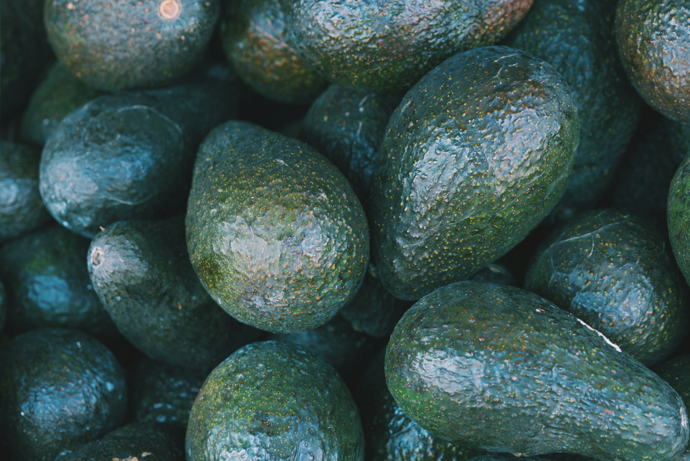
<!-- _color: white -->

## 1: Udvikling af antal solgte avocadoer

- Datakolonner: Total.Volume, Year, Type
- Filtre: Region = TotalUS, Year != 2018

---

## Indsigter: Salgsudvikling

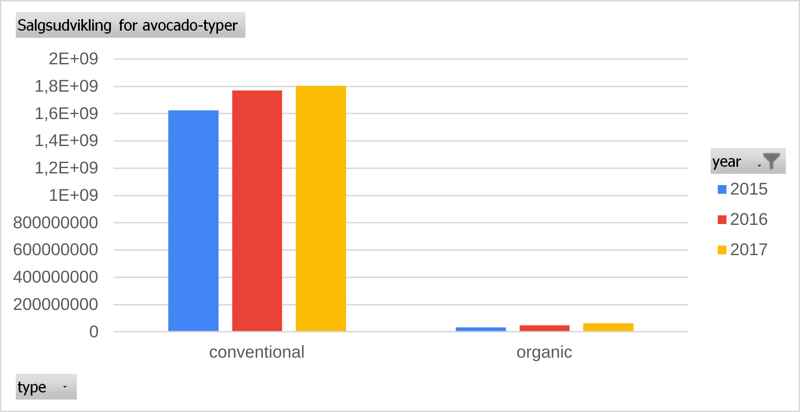

- Støt stigende salg
- Salgsvolumen varierer betydeligt over perioden 2015-2017

---

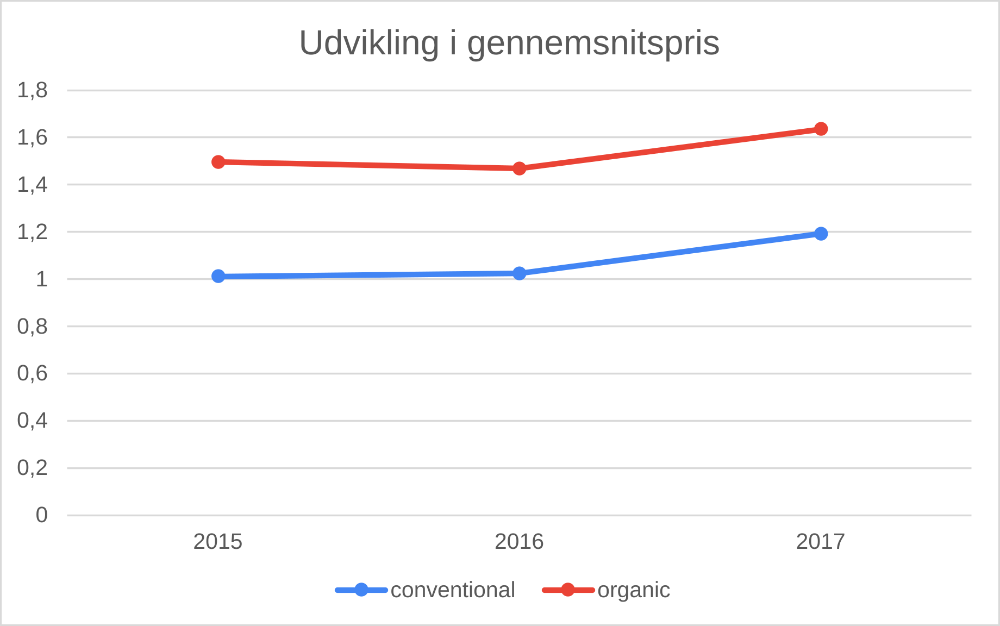

## Indsigter: Pris

- Stigning i gennemsnitspris for avocadoer af begge typer
- Vægtet gennemsnit pr type pr år

---

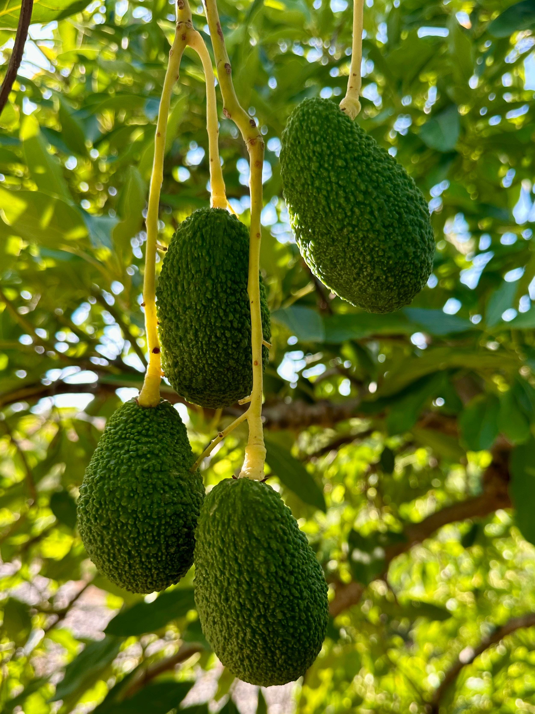

<!-- _color: white -->
<!--  -->

## 2: Fordelingen ml økologiske og konventionelle avocadoer

- Datakolonner: Total.Volume, AveragePrice, Type
- Filtre: Region = TotalUS, Year != 2018

---

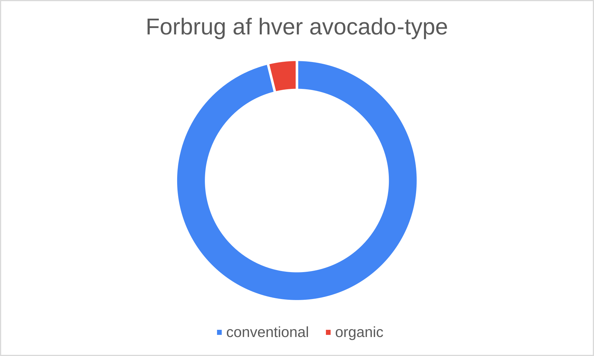

## Indsigter: Fordeling af forbrug

- Forbrug fordelt på avocado-typer
- Økologiske udgør en ganske lille andel

---

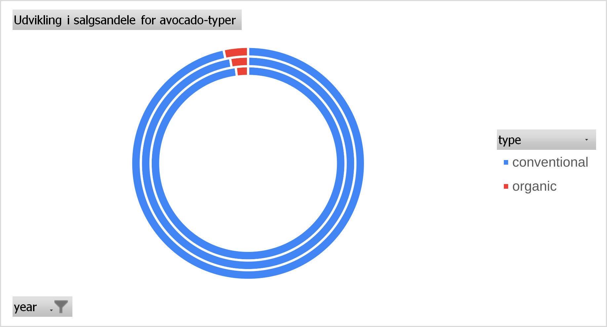

## Indsigter: Udvikling i salgsandele

- Konventionelle vs økologiske salgsandele over tid
- Økologiske udgør en lille men stigende andel

---

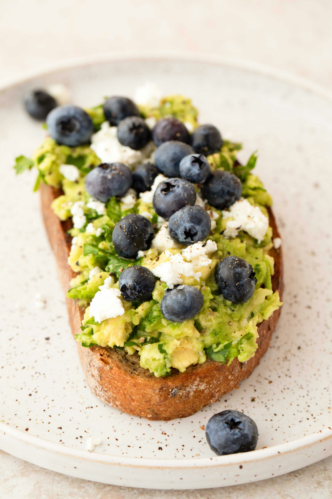

## 3: Forbrug ift månedsdag

- Datakolonner: Total.Volume, Date, AveragePrice
- Filtre: Region = TotalUS, Year != 2018

---

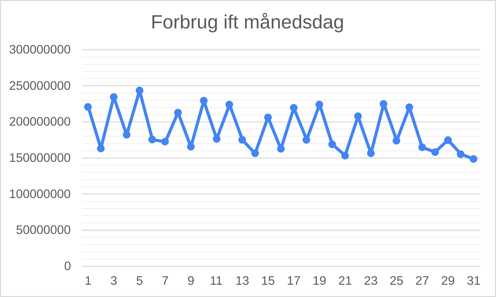

---

## Indsigter: Forbrug ift dage

**Hvor mange penge bruger folk på avocadoer fordelt på dagene i hver måned?**
Der er kun en meget svagt nedadgående tendens; det virker som om forbruget er næsten konstant.

- Savtakket graf: Variation i forbrug pr år kombineret med cykliske registreringsdage

---

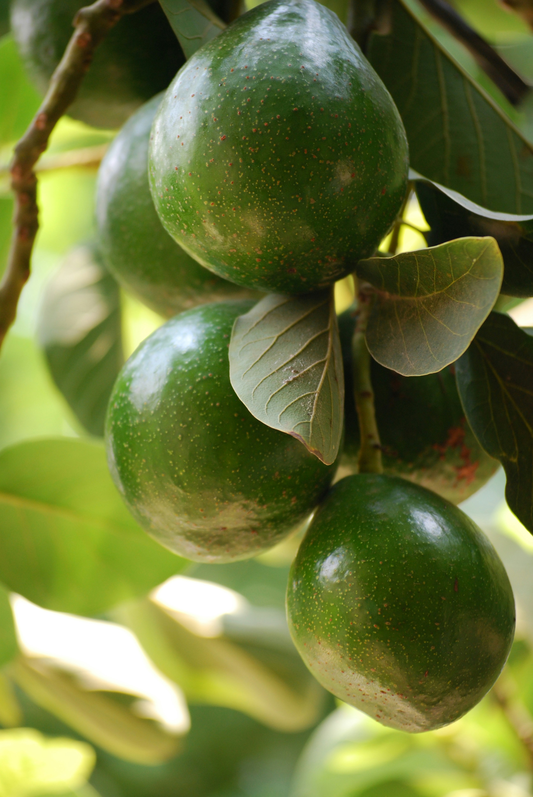

## 5: Sammenhæng mellem pris og volumen

- Datakolonner: AveragePrice, Total.Volume
- Filtre: Region = TotalUS, Year != 2018

---

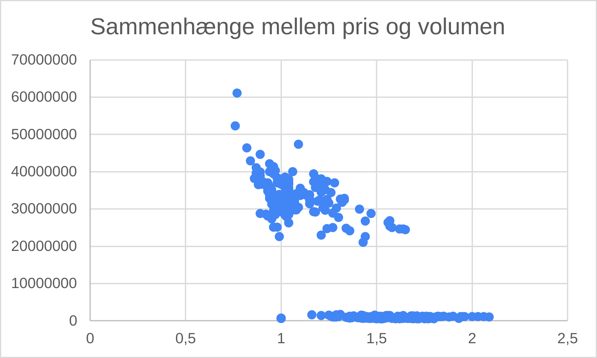

## Indsigter: Pris vs Volumen

**Sælges der flere når de er billige?**
Ja, mange salg sker ved lav pris.

Der er gruppering i punktvisningen:
- Konventionelle sælges i store mængder til lav pris
- Økologiske sælges i mindre mængder til højere priser

Der er variationer inden for dette mønster - måske sæson-betonede.

---

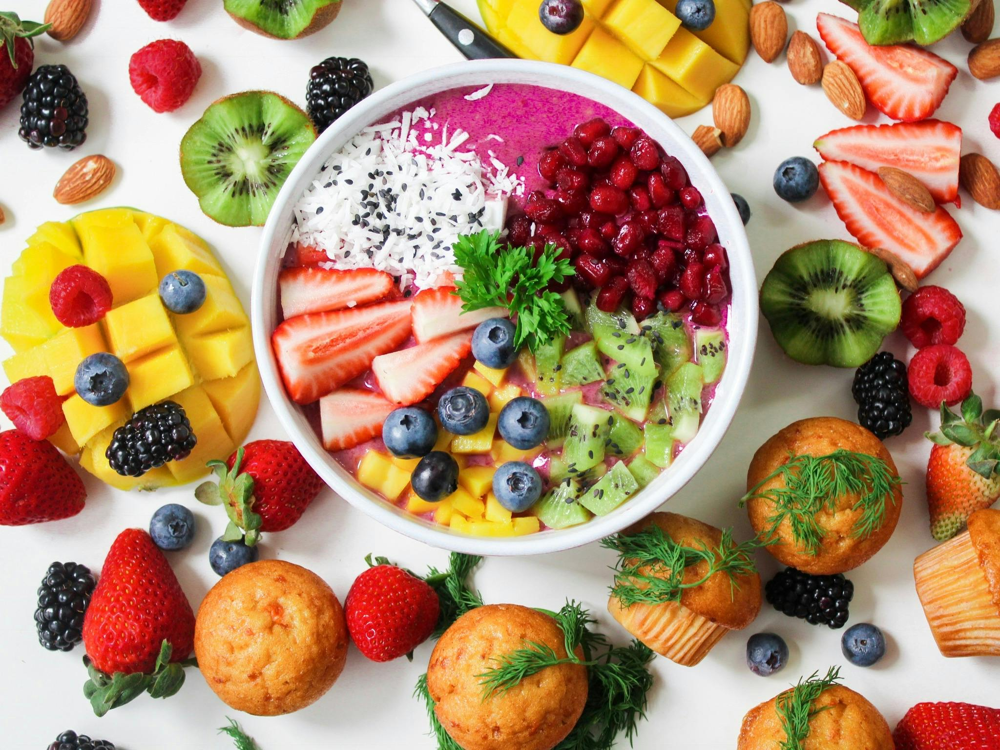

## Yderligere Analyser

**1: Salgskanaler**
- Vælg optimale salgskanaler ift profitmargen, salgsmængder og pålidelighed
- Pain point analyse til sikring af samarbejdet

**2: Sæsonvariationer**
- Maksimer profit ift sæsonen ved at vælge de rigtige salgspriser
- Time series analyse for at identificere sæsonmønstre

---

# Spørgsmål?

## Daytona Analytics

- 7 ugers direkte on-site erfaring
- Besvarer ethvert analysespørgsmål

- **Email:** any-questions-answered@daytona.dk
- **Phone:** +45 11 22 33 44
- **BlueSky:** #Daytona-Answers-All

---

## Metode

- Hastighedsoptimeret datavalidering
- Tolkning af data baseret på erfaringsbaserede antagelser
- Repræsentative spot-checks af antagelser
- Løbende krydscheck af beregninger