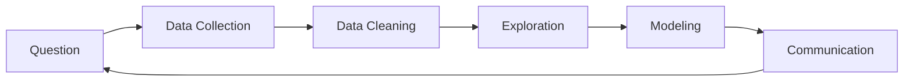

<!-- _class: lead -->
# Lecture 1: Introduction to Data Science
## Foundations & Concepts

**Course:** DATA 101
**Instructor:** [Your Name]
**Date:** April 29, 2026

---

# What is Data Science?

> "Data science is an interdisciplinary field that uses scientific methods, processes, algorithms and systems to extract knowledge and insights from structured and unstructured data." — Wikipedia

**Core Components:**
- Mathematics & Statistics
- Computer Science
- Domain Expertise

---

# The Data Science Process

---

# Types of Data

| Type | Description | Examples |
|------|-------------|----------|
| Numerical | Quantitative | Age, Income, Temperature |
| Categorical | Qualitative | Gender, Color, Brand |
| Ordinal | Ordered categories | Rating (1-5), Education level |
| Time Series | Time-indexed | Stock prices, Weather data |

---

# Descriptive vs Inferential Statistics

## Descriptive Statistics
- Summarize and describe data
- Mean, median, mode, standard deviation
- Visualizations: histograms, boxplots

## Inferential Statistics
- Make predictions about population
- Hypothesis testing, confidence intervals
- Regression, ANOVA

---

# Probability Basics

## Key Concepts

- **Event:** A set of outcomes
- **Probability:** Likelihood of an event (0 to 1)
- **Independent Events:** P(A∩B) = P(A) × P(B)
- **Conditional Probability:** P(A|B) = P(A∩B) / P(B)

---

# Distributions

## Common Distributions

| Distribution | Use Case |
|--------------|----------|
| Normal | Continuous data, central limit theorem |
| Binomial | Binary outcomes (success/failure) |
| Poisson | Count data, rare events |
| Exponential | Time between events |

---

# The Normal Distribution

**Properties:**
- Symmetric around mean
- 68% within 1σ, 95% within 2σ, 99.7% within 3σ
- Defined by mean (μ) and standard deviation (σ)

---

# Correlation

## Pearson Correlation Coefficient

$$ r = \frac{\sum(x_i - \bar{x})(y_i - \bar{y})}{\sqrt{\sum(x_i - \bar{x})^2 \sum(y_i - \bar{y})^2}} $$

- Range: -1 to +1
- +1: Perfect positive correlation
- -1: Perfect negative correlation
- 0: No linear correlation

---

# Visualization: Heatmap Example

**Interpretation:** Color intensity shows relationship strength between variables

---

# Introduction to Machine Learning

## Supervised Learning
- **Classification:** Predict categories (spam/not spam)
- **Regression:** Predict continuous values (house prices)

## Unsupervised Learning
- **Clustering:** Group similar items (customer segmentation)
- **Dimensionality Reduction:** Simplify data (PCA)

---

# Ethics in Data Science

## Key Considerations

1. **Privacy** - Protecting individual data
2. **Bias** - Fairness in algorithms
3. **Transparency** - Explainable models
4. **Consent** - Informed data collection
5. **Accountability** - Responsibility for outcomes

---

# Tools of the Trade

## Programming Languages
- **Python:** Most popular, rich ecosystem
- **R:** Statistical computing, academia
- **SQL:** Database querying

## Libraries (Python)
- numpy, pandas: Data manipulation
- scikit-learn: Machine learning
- matplotlib, seaborn: Visualization

---

# Course Outline

| Week | Topic |
|------|-------|
| 1-2 | Introduction, Python basics |
| 3-4 | Data manipulation with pandas |
| 5-6 | Visualization |
| 7-8 | Statistics & probability |
| 9-10 | Machine learning fundamentals |
| 11-12 | Final project |

---

# Homework Assignment

## Due: Next Week

1. Install Python and Jupyter Notebook
2. Complete the "Hello Data" tutorial
3. Read: Chapter 1-2 of *Python for Data Analysis*
4. **Bonus:** Create a simple visualization of a dataset you find interesting

**Submission:** Upload to course portal

---

<!-- _class: lead -->
# Questions?

## Office Hours

**Monday & Wednesday:** 2:00 PM - 4:00 PM
**Location:** Room 301, Computer Science Building
**Email:** prof@university.edu
