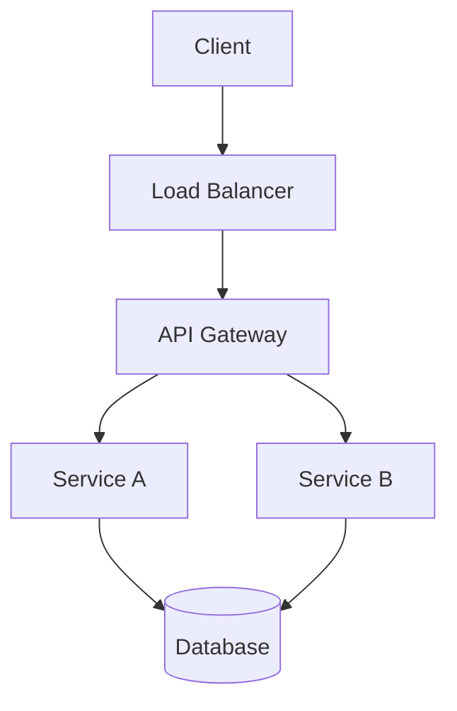

<!-- _class: lead -->
# Technical Deep Dive
## System Architecture & Implementation

**Version:** 2.0
**Date:** April 29, 2026

---

# Architecture Overview



**Tech Stack:**
- Backend: Node.js + Express
- Database: PostgreSQL
- Cache: Redis
- Message Queue: RabbitMQ

---

# Code Example

## Data Processing Pipeline

```typescript
interface DataRecord {
  id: string;
  value: number;
  timestamp: Date;
}

async function processBatch(records: DataRecord[]): Promise<void> {
  const validated = records.filter(validate);
  const transformed = await transformData(validated);
  await saveToDatabase(transformed);
}
```

---

# Performance Metrics

| Operation | Latency (p50) | Latency (p99) | Throughput |
|-----------|---------------|---------------|------------|
| Read | 12ms | 45ms | 5K req/s |
| Write | 18ms | 68ms | 3K req/s |
| Update | 15ms | 52ms | 4K req/s |

---

# Database Schema

```sql
CREATE TABLE users (
  id UUID PRIMARY KEY,
  email VARCHAR(255) UNIQUE NOT NULL,
  created_at TIMESTAMP DEFAULT NOW(),
  metadata JSONB
);

CREATE INDEX idx_users_email ON users(email);
CREATE INDEX idx_users_metadata ON users USING GIN(metadata);
```

---

# Caching Strategy

## Redis Implementation

- **L1 Cache:** In-memory (Node.js)
- **L2 Cache:** Redis Cluster
- **TTL Policy:** 
  - Static data: 1 hour
  - User data: 15 minutes
  - Session: 30 minutes

> Cache hit rate: **94.3%** (target: >90%)

---

# Error Handling

## Retry Policy

```typescript
const retryPolicy = {
  maxRetries: 3,
  backoff: 'exponential',
  initialDelay: 100, // ms
  maxDelay: 5000
};

await withRetry(() => apiCall(), retryPolicy);
```

---

# Monitoring & Observability

- **Metrics:** Prometheus + Grafana
- **Logging:** ELK Stack
- **Tracing:** Jaeger
- **Alerts:** PagerDuty integration

**Key Dashboards:**
- System health
- API performance
- Error rates
- Business metrics

---

# Deployment Pipeline

1. **Code Review** → GitHub PR
2. **CI/CD** → GitHub Actions
3. **Staging** → Automated deploy
4. **Production** → Blue-green deployment

**Rollback Strategy:** Automated on error rate >5%

---

<!-- _class: lead -->
# Questions?

## Technical Resources

**Docs:** docs.company.com
**GitHub:** github.com/company/repo
**Slack:** #engineering
